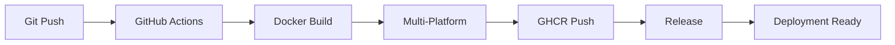

# 🚀 GitHub Actions - CI/CD Pipeline


## 📋 Überblick

Das Smart Home Control System nutzt GitHub Actions für vollautomatisierte Builds, Tests und Deployments. Alle Docker Images werden automatisch zur **GitHub Container Registry (GHCR)** gepusht.

### 🎯 CI/CD Pipeline



## 🔧 Workflows

### 1. 🐳 Docker Build & Publish (`docker-publish.yml`)

**Trigger-Events:**
- ✅ Push auf `main` oder `master` Branch
- ✅ Push von Tags (`v*`)
- ✅ Pull Requests (nur Build, kein Push)

**🚀 Features:**
- **Multi-Platform Builds**: `linux/amd64`, `linux/arm64`
- **GitHub Actions Cache**: Schnellere Builds durch Layer-Caching
- **Automatisches Tagging**: Basierend auf Git-Referenzen
- **Smart Publishing**: Nur bei Push-Events (nicht bei PRs)
- **Build Summary**: Automatische Deployment-AnweisungenI/CD

## Übersicht

Das Smart Home Control System nutzt GitHub Actions für automatisierte Builds, Tests und Deployments. Alle Docker Images werden automatisch zur GitHub Container Registry (GHCR) gepusht.

## Workflows

### 1. Docker Build & Publish (`docker-publish.yml`)

**Trigger:**
- Push auf `main` oder `master` Branch
- Push von Tags (`v*`)
- Pull Requests

**Features:**
- Multi-Platform Builds (linux/amd64, linux/arm64)
- GitHub Actions Cache für schnellere Builds
- Automatisches Tagging basierend auf Git-Referenzen
- Nur Publishing bei Push-Events (nicht bei PRs)

**🏷️ Generierte Tags:**
| Git Referenz | Docker Tag | Beschreibung |
|-------------|------------|-------------|
| `main` branch | `latest` | Neueste Entwicklungsversion |
| `v1.2.3` tag | `v1.2.3`, `v1.2`, `v1` | Semver-basierte Tags |
| `feature/xyz` branch | `feature-xyz` | Branch-spezifische Builds |
| `PR #123` | `pr-123` | Pull Request Builds |

### 2. 🏷️ Release (`release.yml`)

**Trigger-Events:**
- ✅ Push von Git-Tags (`v*`)

**🚀 Features:**
- **Automatische Changelog-Generierung** aus Git-Commits
- **GitHub Release** mit Release Notes  
- **Deployment-Anweisungen** in Job Summary
- **Multi-Platform Docker Images** mit Versionierung

## 🎮 Verwendung

### 🔄 Automatischer Build bei Code-Änderungen

```bash
# Jeder Push auf main → automatischer Build + latest Tag
git add .
git commit -m "Feature: Neue Lichtsteuerung"
git push origin main

# GitHub Actions führt automatisch aus:
# 1. ✅ Code Checkout
# 2. 🐳 Docker Build (Multi-Platform)
# 3. 📦 Push zu GHCR als 'latest'
# 4. 📋 Build Summary generieren
```

### 🏷️ Release erstellen

```bash
# 1. Version Tag erstellen und pushen
git tag v1.0.0
git push origin v1.0.0

# 2. GitHub Actions erstellt automatisch:
#    ✅ GitHub Release mit Changelog
#    🐳 Docker Images: v1.0.0, v1.0, v1
#    📋 Deployment-Dokumentation
#    🔗 Release Notes mit Git-History
```

### 📥 Images verwenden

```bash
# 🔥 Latest Development Build
docker pull ghcr.io/deltatree-de/iot-haus:latest

# 🏆 Spezifische Release Version
docker pull ghcr.io/deltatree-de/iot-haus:v1.0.0

# 🎯 Mit Production Compose
docker-compose -f docker-compose.prod.yml up -d
```

## 🔧 Repository-Einstellungen

### ✅ Erforderliche Berechtigungen

Die folgenden Berechtigungen sind bereits in den Workflows konfiguriert:

| Permission | Scope | Verwendung |
|------------|-------|------------|
| `contents: read` | Repository | Code Checkout und Zugriff |
| `packages: write` | GHCR | Docker Image Push |
| `contents: write` | Repository | Release-Erstellung (nur release.yml) |

### 🔐 Automatische Secrets

Die Workflows nutzen automatische GitHub-Variablen:

| Variable | Typ | Beschreibung |
|----------|-----|-------------|
| `GITHUB_TOKEN` | Secret | Automatisch verfügbar |
| `GITHUB_REPOSITORY` | Variable | Repository-Name für Image-Tagging |
| `GITHUB_ACTOR` | Variable | Username für GHCR Login |

### 🌍 Environment Variables

```yaml
env:
  REGISTRY: ghcr.io
  IMAGE_NAME: ${{ github.repository }}
```

## 🏗️ Build-Details

### 📦 Multi-Platform Matrix

Die Builds erstellen Images für folgende Architekturen:

| Platform | Beschreibung | Verwendung |
|----------|-------------|------------|
| `linux/amd64` | x86_64 Intel/AMD | Standard Server, Desktop |
| `linux/arm64` | ARM64 | Apple Silicon, AWS Graviton, Raspberry Pi |

### ⚡ Build-Optimierungen

- **🎯 Build Cache**: GitHub Actions Cache für Docker Layers
- **🏗️ BuildKit**: Erweiterte Docker Build Features
- **📋 Multi-Stage**: Optimierte Dockerfile für kleine Images
- **⚡ Parallel Builds**: Concurrent Builds für verschiedene Plattformen

### 🔍 Cache-Strategy

```yaml
cache-from: type=gha
cache-to: type=gha,mode=max
```

## 📊 Monitoring & Status

### 🏷️ Build Status überprüfen

```bash
# GitHub CLI verwenden
gh workflow list
gh workflow view "Build and Publish Docker Image"

# Letzte Runs anzeigen  
gh run list --workflow="docker-publish.yml"

# Live-Status verfolgen
gh run watch
```

### 📝 Logs einsehen

```bash
# Logs für letzten Run
gh run view --log

# Spezifischen Run anzeigen
gh run view <run-id> --log

# Workflow-spezifische Logs
gh run view --log --job="build-and-push"
```

### 🌐 Web-Interface

- **Actions Tab**: https://github.com/deltatree-de/iot-haus/actions
- **Packages**: https://github.com/deltatree-de/iot-haus/pkgs/container/iot-haus
- **Releases**: https://github.com/deltatree-de/iot-haus/releases

## 🚨 Troubleshooting

### Häufige Probleme

**❌ Build schlägt fehl:**
```bash
# 1. Dockerfile-Syntax prüfen
docker build . --dry-run

# 2. Dependencies prüfen
npm audit
npm install

# 3. Lokalen Build testen
docker build -t test-build .
```

**❌ Push zu GHCR schlägt fehl:**
```yaml
# Berechtigungen prüfen (sollten automatisch korrekt sein)
permissions:
  contents: read
  packages: write
```

**❌ Multi-Platform Build-Probleme:**
```bash
# Dependencies für beide Architekturen verfügbar?
# Buildx Setup prüfen
docker buildx ls
docker buildx inspect --bootstrap
```

### 🐛 Debug-Modus

```yaml
# In Workflow-Steps hinzufügen für detaillierte Logs
env:
  ACTIONS_STEP_DEBUG: true
  RUNNER_DEBUG: 1
```

## 📈 Performance-Metriken

### Build-Zeiten
- **Ohne Cache**: ~8-12 Minuten
- **Mit Cache**: ~2-4 Minuten  
- **Multi-Platform**: +50% Zeit

### Image-Größen
- **Komprimiert**: ~150 MB
- **Entpackt**: ~400 MB
- **Multi-Arch Manifest**: ~300 KB

---

🤖 **GitHub Actions Setup** - Vollautomatisierte CI/CD Pipeline für Smart Home Control
