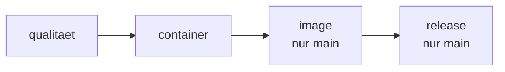

# IoT-Haus 2.0 – GitHub Actions


Es gibt genau einen Workflow: [`.github/workflows/ci-release.yml`](.github/workflows/ci-release.yml) („CI und Release“).
Er ersetzt die früheren `docker-publish.yml` und `release.yml`.

## Auslöser

| Ereignis | Was läuft |
|---|---|
| Pull Request gegen `main` | `qualitaet` → `container` (nur prüfen, nichts veröffentlichen) |
| Push auf `main` | `qualitaet` → `container` → `image` → `release` |

Tag-Pushes lösen **nichts** aus. Tags und Releases erzeugt der Workflow selbst, nachdem alle Prüfungen grün sind.
Ein neuer Lauf bricht einen laufenden PR-Lauf desselben Branches ab; Läufe auf `main` werden nie abgebrochen.

## Jobs


```mermaid
graph LR
    Q[qualitaet] --> C[container]
    C --> I[image<br/>nur main]
    I --> R[release<br/>nur main]
```

### 1. `qualitaet` – Lint, Typen, Tests, Build, Audit

Node 22, `npm ci`, dann:

| Schritt | Befehl | Bricht ab bei |
|---|---|---|
| Lint | `npm run lint` | jedem Fehler und jeder Warnung |
| Typecheck | `npm run typecheck` | Typfehler |
| Tests | `npm test -- --coverage` | rotem Test oder < 90 % Zeilenabdeckung in `src/domain/**` und `server/zustandsdienst.ts` |
| Build | `npm run build` (Ausgabe nach `build.log`) | Buildfehler |
| JS-Budget | `node scripts/pruefe-js-budget.mjs build.log` | First Load JS der Route `/` > 200 kB |
| Audit | `npm audit --omit=dev --audit-level=high` | Laufzeitabhängigkeit mit hoher oder kritischer Lücke |

### 2. `container` – das gebaute Image prüfen

1. Image für `linux/amd64` bauen (`iot-haus:ci`, Build-Cache `type=gha`).
2. **Härtung:** Im Image dürfen `curl`, `wget`, `npm`, `npx`, `corepack`, `yarn`, `apk`, `nc` nicht existieren; die UID muss 1000 sein.
3. Container mit Volume starten und mit [`scripts/warte-healthy.sh`](scripts/warte-healthy.sh) `ci 60` warten, bis der Image-Healthcheck
   `healthy` meldet (höchstens 60 s; sonst Container-Log und Abbruch).
4. **Rauchtest** [`scripts/smoke-container.mjs`](scripts/smoke-container.mjs) `schalten`: `/api/health` = 200 mit der Version aus
   `package.json`, Snapshot mit 28 Geräten, PC einschalten → `bestaetigt`.
5. `docker restart`, erneut mit `warte-healthy.sh` auf `healthy` warten, Rauchtest `pruefen`: Der PC ist nach dem Neustart noch an (Persistenz im echten Mosquitto).
6. Container-Log wird immer ausgegeben.

### 3. `image` – `:latest` veröffentlichen (nur Push auf `main`)

Multi-Arch-Build `linux/amd64,linux/arm64` und Push nach `ghcr.io/deltatree-de/iot-haus` mit den Tags

- `:latest` – das läuft produktiv per `docker-compose.prod.yml`,
- `:sha-<kurz>` – der kurze Commit-Hash, für feste Stände und Rückkehr zu einem Stand.

Der Digest geht als Ausgabe an `release`.

### 4. `release` – Version, Tag und GitHub Release (nur Push auf `main`)

1. Version lesen: `node -p "require('./package.json').version"`.
2. Gibt es das GitHub Release `v<version>` schon (`gh release view`), endet der Job ohne Änderung („Release existiert bereits“).
3. Sonst wird jeder Teil einzeln angelegt, **nur wenn er fehlt**, in dieser Reihenfolge:
   1. Image-Tag `:<version>` (Prüfung per `docker buildx imagetools inspect`): auf denselben Digest wie `:latest` setzen
      (`docker buildx imagetools create`, kein neuer Build).
   2. Git-Tag `v<version>` (Prüfung per `git ls-remote --tags`): auf den Commit setzen und pushen.
   3. GitHub Release „IoT-Haus v&lt;version&gt;“ mit dem Text aus `.github/release-hinweise/v<version>.md` plus automatisch
      erzeugter Änderungsliste.

Der Job ist dadurch idempotent: Bricht ein Lauf mittendrin ab (z. B. nach dem Tag, vor dem Release), vervollständigt ihn ein Re-Run
oder der nächste Push auf `main`, statt still grün zu enden. Existiert ein Teil schon, bleibt er unverändert; ein vorhandenes
Versions-Image oder ein vorhandener Tag wird nicht auf einen neueren Commit verschoben.

Fehlt die Datei mit den Release-Hinweisen, schlägt der Job fehl, bevor etwas angelegt wird. `:latest` und `:sha-…` sind dann schon
veröffentlicht. Nach dem Nachreichen der Datei legt der nächste Push auf `main` Versions-Image, Tag und Release an.

## Erlaubte Image-Tags

Nur `:latest`, `:<version>` (z. B. `:2.0.0`) und `:sha-<kurz>`. Tags wie `:main`, `:2.0` oder `:2` gibt es nicht.

## Ein Release erstellen

1. Im Feature-Branch `version` in `package.json` hochsetzen (und `package-lock.json` per `npm install --package-lock-only` angleichen).
2. `.github/release-hinweise/v<version>.md` anlegen. Vorlage: [`v2.0.0.md`](.github/release-hinweise/v2.0.0.md), inklusive
   Upgrade-Hinweisen, falls Betreiber etwas tun müssen.
3. Pull Request gegen `main`; `qualitaet` und `container` müssen grün sein.
4. Merge. Der Push auf `main` veröffentlicht `:latest`, `:sha-…`, `:<version>`, den Tag `v<version>` und das GitHub Release.

Ohne Versionssprung veröffentlicht jeder Merge nur `:latest` und `:sha-…`.

## Berechtigungen

- Standard für den Workflow: `contents: read`.
- `image`: zusätzlich `packages: write`.
- `release`: `contents: write` (Tag und Release) und `packages: write` (Versions-Tag).
- Anmeldung an GHCR mit dem automatischen `GITHUB_TOKEN`; weitere Secrets sind nicht nötig.
- Actions werden über Hauptversions-Tags eingebunden (`actions/checkout@v4`, `actions/setup-node@v4`, `docker/*-action@v3/v5/v6`).

## Lokal dasselbe prüfen

```bash
npm ci
npm run lint && npm run typecheck && npm test -- --coverage
npm run build 2>&1 | tee build.log && node scripts/pruefe-js-budget.mjs build.log
npm audit --omit=dev --audit-level=high

docker build -t iot-haus:ci .
docker run -d --name ci -p 3000:3000 -v ci-daten:/var/lib/mosquitto iot-haus:ci
scripts/warte-healthy.sh ci 60
node scripts/smoke-container.mjs schalten
docker restart ci && scripts/warte-healthy.sh ci 60 && node scripts/smoke-container.mjs pruefen
docker rm -f ci && docker volume rm ci-daten
```
