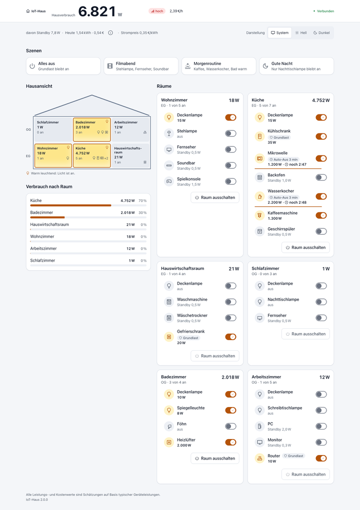
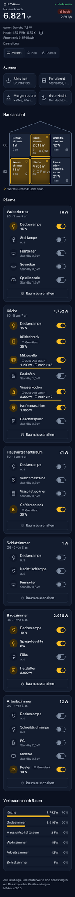

# IoT-Haus 2.0

Ein simuliertes Zuhause im Browser: **28 Geräte in 6 Räumen** schalten, und der Hausverbrauch ändert sich live in Watt und Euro.
Alle Browser im Heimnetz sehen denselben Zustand. Der Server hält den Zustand und speichert ihn im eingebetteten MQTT-Broker,
sodass er Neustarts übersteht.





## Funktionen

- **28 Geräte, 6 Räume auf 2 Etagen:** Lampen, Fernseher, Soundbar, Spielkonsole, Kühlschrank, Mikrowelle, Backofen,
  Wasserkocher, Kaffeemaschine, Geschirrspüler, Waschmaschine, Trockner, Föhn, Heizlüfter, PC, Monitor, Router und mehr,
  jeweils mit typischer Betriebs- und Standby-Leistung.
- **Live-Verbrauch:** Der Kopfbereich zeigt den Hausverbrauch in Watt, eine Laststufe (niedrig < 500 W, mittel < 2.000 W, sonst hoch)
  und die Kosten pro Stunde. Er bleibt beim Scrollen sichtbar. Beim Schalten zählt die Zahl animiert hoch, und eine Meldung nennt die
  Differenz, z. B. „+1.199 W · Mikrowelle (Küche)“. Dazu kommen Verbrauch je Raum und je Gerät, der Standby-Anteil sowie der
  Tagesverbrauch in kWh und € (Tageswechsel um 00:00 Uhr Europe/Berlin).
- **Szenen:** Alles aus, Filmabend, Morgenroutine, Gute Nacht. Außerdem „Raum ausschalten“ je Raumkarte.
- **Grundlastschutz:** Kühlschrank, Gefrierschrank und Router sind als Grundlast markiert. Szenen und „Raum ausschalten“ lassen sie an.
  Beim Einzelschalten fragt ein Dialog nach.
- **Auto-Aus:** Wasserkocher und Mikrowelle schalten nach 3 Minuten automatisch ab. Die Restzeit wird angezeigt, und der Timer läuft
  auch nach einem Serverneustart weiter.
- **Server als einzige Quelle der Wahrheit:** Ein neu geöffneter Browser ändert nichts. Änderungen erreichen alle verbundenen Browser.
  Wenn die Verbindung abreißt, erscheint ein Banner, und der Browser verbindet sich automatisch neu.
- **Dunkelmodus:** System, Hell oder Dunkel. Die Wahl wird nur im Browser gespeichert (`localStorage`-Schlüssel `iot-haus.theme`).
- **Barrierefreiheit (Ziel WCAG 2.2 AA):** Sprunglink, vollständige Tastaturbedienung, Schalter mit `role="switch"`,
  Screenreader-Ansagen über eine Live-Region (z. B. „Deckenlampe an. Hausverbrauch 6.821 Watt.“), Zoom bis 200 % ohne Zoomsperre,
  `prefers-reduced-motion` wird beachtet. Den Prüfstand beschreibt [docs/abnahme-2.0.md](docs/abnahme-2.0.md).

Alle Leistungs- und Kostenwerte sind Schätzungen auf Basis typischer Geräteleistungen. Es werden keine echten Geräte geschaltet.

## Gerätekatalog

Die einzige Quelle für Räume, Geräte, Leistungen, Grundlast und Auto-Aus ist
[`src/domain/katalog.ts`](src/domain/katalog.ts). Die Szenen stehen in [`src/domain/szenen.ts`](src/domain/szenen.ts).
Außerhalb von `src/domain/` stehen keine Geräte-IDs; ein Architekturtest prüft das.

Angaben: Betrieb in W, Standby in Klammern. **G** = Grundlast, **A** = Auto-Aus nach 3 min.

| Raum (Etage) | Geräte |
|---|---|
| Wohnzimmer (EG) | Deckenlampe 15 · Stehlampe 10 · Fernseher 90 (0,5) · Soundbar 25 (0,5) · Spielkonsole 180 (1,5) |
| Küche (EG) | Deckenlampe 15 · Kühlschrank 35 **G** · Mikrowelle 1.200 (1,5) **A** · Backofen 2.000 (1) · Wasserkocher 2.200 **A** · Kaffeemaschine 1.300 (1) · Geschirrspüler 600 (0,5) |
| Hauswirtschaftsraum (EG) | Deckenlampe 10 · Waschmaschine 500 (0,5) · Wäschetrockner 700 (0,5) · Gefrierschrank 20 **G** |
| Schlafzimmer (OG) | Deckenlampe 12 · Nachttischlampe 5 · Fernseher 40 (0,5) |
| Badezimmer (OG) | Deckenlampe 10 · Spiegelleuchte 8 · Föhn 1.800 · Heizlüfter 2.000 |
| Arbeitszimmer (OG) | Deckenlampe 12 · Schreibtischlampe 6 · PC 150 (2) · Monitor 25 (0,3) · Router 10 **G** |

Beim allerersten Start sind nur die Grundlastgeräte an. Der Hausverbrauch beträgt dann 75,3 W, davon 10,3 W Standby.

## Konfiguration

| Variable | Standard | Wirkung |
|---|---|---|
| `STROMPREIS_EUR_PRO_KWH` | `0.35` | Strompreis in €/kWh, mit Dezimalpunkt (z. B. `0.32`). `0` ist gültig. Leere, ungültige oder negative Werte ergeben `0.35` und die Logzeile `strompreis_ungueltig`. |
| `ERLAUBTE_HOSTS` | leer (jeder Host) | Optional, Schutz gegen DNS-Rebinding: kommagetrennte Hostnamen **ohne Port**, Groß-/Kleinschreibung egal, z. B. `haus.local,192.168.1.10`. Ist die Liste gesetzt, nimmt der Server WebSocket-Verbindungen nur an, wenn der `Host`-Header und ein vorhandener `X-Forwarded-Host` darin stehen, sonst HTTP 403. |
| `PORT` | `3000` | HTTP- und WebSocket-Port (auch der Healthcheck im Image nutzt ihn) |
| `HOSTNAME` | `0.0.0.0` | Bind-Adresse |
| `MQTT_BROKER_HOST` / `MQTT_BROKER_PORT` | `127.0.0.1` / `1883` | Eingebetteter Mosquitto im Container |
| `NODE_ENV` | `production` (im Image) | Alles außer `production` startet Next im Entwicklungsmodus |

`NEXT_PUBLIC_MQTT_BROKER_URL` aus 1.x wird nicht mehr benötigt und ignoriert.

## Betrieb mit Docker Compose

Das Image `ghcr.io/deltatree-de/iot-haus:latest` wird bei jedem Push auf `main` für `linux/amd64` und `linux/arm64` gebaut.
Für den Betrieb dient [`docker-compose.prod.yml`](docker-compose.prod.yml):

```bash
docker compose -f docker-compose.prod.yml up -d
docker ps          # nach spätestens 60 s: (healthy)
```

Danach ist die App unter `http://<host>:3000` erreichbar. Den Strompreis setzt man in der Compose-Datei unter `environment`:

```yaml
    environment:
      - STROMPREIS_EUR_PRO_KWH=0.32
```

- **Daten:** Gerätezustände und Tagesverbrauch liegen im Volume `mosquitto-data` (`/var/lib/mosquitto`). Das Volume nicht löschen,
  sonst startet das Haus im Ausgangszustand.
- **Healthcheck:** Das Image bringt ihn mit (`node -e "fetch('http://127.0.0.1:'+(process.env.PORT||3000)+'/api/health')…"`, ohne curl).
  In der Compose-Datei wird **kein** eigener `healthcheck`-Block gesetzt.
- **Logs:** `docker compose -f docker-compose.prod.yml logs -f`. Das Format ist eine Zeile pro Ereignis
  (`<Zeit> INFO|WARN|FEHLER <ereignis> schluessel=wert`), ohne Nutzdaten.

Details zu Image, Härtung und lokalem Bauen: [DOCKER-SETUP.md](DOCKER-SETUP.md). Kubernetes: [KUBERNETES.md](KUBERNETES.md).

## Update

```bash
docker compose -f docker-compose.prod.yml pull
docker compose -f docker-compose.prod.yml up -d
docker ps          # nach spätestens 60 s: (healthy)
```

Ab 2.0 zeigen geöffnete Browser-Tabs einer älteren Version danach „Neue Version verfügbar“ und laden per Knopf neu.
Soll eine bestimmte Version laufen, `:latest` durch `:2.0.0` oder `:sha-<commit>` ersetzen (siehe [GITHUB-ACTIONS.md](GITHUB-ACTIONS.md)).

### Upgrade-Hinweis 2.0.0

Beim Wechsel von 1.x auf 2.0.0 gibt es einen einzigen manuellen Schritt: Enthält die Compose-Datei auf dem Host noch den alten
`healthcheck`-Block mit `curl`, diesen Block **einmalig entfernen**.

```yaml
    # ENTFERNEN – curl gibt es im gehärteten Image nicht:
    healthcheck:
      test: ["CMD", "curl", "-f", "http://localhost:3000/api/health"]
      ...
```

Der alte Block überschreibt den Healthcheck des Images und meldet den Container sonst dauerhaft als `unhealthy`.
`docker compose pull` ändert die Compose-Datei auf dem Host nicht. Ebenfalls überflüssig, aber unschädlich: das Volume
`mosquitto-logs` und `NEXT_PUBLIC_MQTT_BROKER_URL`. Port 3000, Imagename, Volume `mosquitto-data` und die übrigen Variablen bleiben gültig.
Zustände aus 1.x (Topics `smarthome/…`) werden nicht übernommen; 2.0 startet einmalig im Ausgangszustand.
Browser-Tabs, die noch 1.x geöffnet haben, können nach dem Update nicht mehr schalten und müssen einmal neu geladen werden.

## Zugriff aus dem Internet

IoT-Haus hat **keine Anmeldung** und ist für das Heimnetz gedacht. Port 3000 nicht per Portweiterleitung freigeben.
Für Zugriff von außen gehört ein **Reverse-Proxy mit TLS und Anmeldung** davor, z. B. Caddy:

```caddyfile
haus.example.de {
    basic_auth {
        # Hash erzeugen: caddy hash-password
        familie $2a$14$...
    }
    reverse_proxy 127.0.0.1:3000
}
```

- Die Anmeldung muss für **alle** Pfade gelten, auch für den WebSocket `/mqtt`. Caddy leitet WebSockets automatisch weiter;
  bei nginx sind `proxy_http_version 1.1`, `Upgrade`- und `Connection`-Header nötig (Beispiel in [DOCKER-SETUP.md](DOCKER-SETUP.md)).
- Wer Anmeldung per Cookie bevorzugt (z. B. Authelia oder oauth2-proxy als Forward-Auth), umgeht Browser-Eigenheiten bei Basic Auth
  und WebSockets.
- Der Proxy muss den `Host`-Header durchreichen oder `X-Forwarded-Host` setzen. Sonst lehnt der Server den WebSocket wegen der
  Origin-Prüfung mit 403 ab. Mit gesetztem `ERLAUBTE_HOSTS` gilt strenger: **beide** Werte müssen in der Liste stehen – reicht der Proxy `Host` nicht durch (Upstream-Name wie `iot-haus:3000`), diesen internen Namen ebenfalls in `ERLAUBTE_HOSTS` aufnehmen, sonst 403 (`grund=host`).
- Läuft der Proxy auf demselben Host, den Port nur lokal veröffentlichen: `"127.0.0.1:3000:3000"`.
- Zusätzlich `ERLAUBTE_HOSTS` auf die tatsächlich genutzten Namen setzen (z. B. `haus.example.de,haus.local`). Das schützt
  gegen DNS-Rebinding, also fremde Webseiten, die sich über einen manipulierten DNS-Namen Zugang zum Heimnetz-Server verschaffen.

## Entwicklung

Voraussetzung: Node.js 22.

```bash
npm ci
npm run dev:broker     # Terminal 1: MQTT-Entwicklungsbroker (aedes) auf 127.0.0.1:1883, Zustand nur im Speicher
npm run dev            # Terminal 2: kompiliert server/ und startet Next im Dev-Modus auf http://localhost:3000
```

| Befehl | Zweck |
|---|---|
| `npm test` | alle Tests einmal (Vitest: Domäne, Server, Integration mit aedes, Komponenten mit axe, Architekturregeln) |
| `npm test -- --coverage` | mit Abdeckung; Schwelle 90 % Zeilen für `src/domain/**` und `server/zustandsdienst.ts` |
| `npm run test:watch` | Tests im Watch-Modus |
| `npm run lint` | ESLint, 0 Warnungen erlaubt |
| `npm run typecheck` | `tsc --noEmit` über App, Server, Domäne und Tests |
| `npm run build` | `next build` und Server-Kompilat nach `dist/` |
| `npm start` | gebaute App starten (`node dist/server/index.js`, braucht einen Broker) |
| `npm run compose:up` / `compose:down` / `compose:logs` | Image lokal bauen und per `docker-compose.yml` betreiben |

Vor einem Pull Request laufen lokal dieselben Prüfungen wie in der CI: `npm run lint && npm run typecheck && npm test && npm run build`.

## Architektur in Kürze

```
Browser ──HTTP :3000──► Node-Server (dist/server/index.js)
        ◄══WS /mqtt══►    ├ /api/health
   (nur Befehle hin,      ├ Next.js (Seite, Assets)
    Ereignisse zurück)    ├ WebSocket-Schicht (Prüfung, Limits, Verteilung)
                          ├ Zustandsdienst (Zustand, Energie, Auto-Aus)
                          └ MQTT-Speicher ──► Mosquitto 127.0.0.1:1883 ──► Volume mosquitto-data
```

- **Ein Container:** supervisord startet Mosquitto und den Node-Server als Benutzer 1000.
- **Browser sprechen kein MQTT.** Sie senden nur drei Befehle (`schalten`, `szene`, `raumAus`) als JSON über `/mqtt`
  und bekommen `snapshot`, `aenderung`, `bestaetigt`, `fehler` und `energie`. Details: [API.md](API.md).
- **Der Server ist der einzige MQTT-Client.** Er speichert jeden Gerätezustand und den Tagesverbrauch als retained Nachricht
  unter `iot-haus/v2/…`.
- **Eine Codebasis für beide Seiten:** Katalog, Szenen, Rechenlogik, Befehlsprüfung und Protokolltypen liegen in `src/domain/`
  und werden von Server (`server/`) und Browser (`src/client/`, `src/components/`) gemeinsam genutzt.

Mehr dazu: [docs/architecture.md](docs/architecture.md) (Überblick) und
[_bmad-output/planning-artifacts/architecture.md](_bmad-output/planning-artifacts/architecture.md) (vollständige Entscheidungen).
Alle Projektdokumente listet [docs/index.md](docs/index.md) auf.

## CI/CD

Ein einziger Workflow, [`.github/workflows/ci-release.yml`](.github/workflows/ci-release.yml):

1. **qualitaet** (PR und `main`): Lint, Typecheck, Tests mit Abdeckung, Build, JS-Budget (First Load JS ≤ 200 kB), `npm audit`.
2. **container** (PR und `main`): Image bauen, Härtung prüfen (kein curl/wget/npm, UID 1000), healthy in ≤ 60 s (`scripts/warte-healthy.sh`),
   Rauchtest, Neustart und Persistenzprüfung.
3. **image** (nur `main`): Multi-Arch-Image als `:latest` und `:sha-<kurz>` nach GHCR.
4. **release** (nur `main`): Gibt es zur Version aus `package.json` noch kein GitHub Release, entstehen Image-Tag `:<version>`,
   Git-Tag `v<version>` und GitHub Release, jeweils nur falls noch nicht vorhanden (idempotent).

Ein Release entsteht also durch Hochsetzen der Version in `package.json` plus Release-Hinweise unter
`.github/release-hinweise/v<version>.md`. Einzelheiten: [GITHUB-ACTIONS.md](GITHUB-ACTIONS.md).
