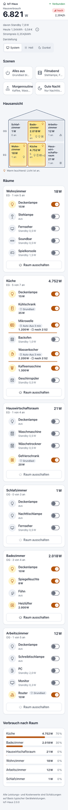
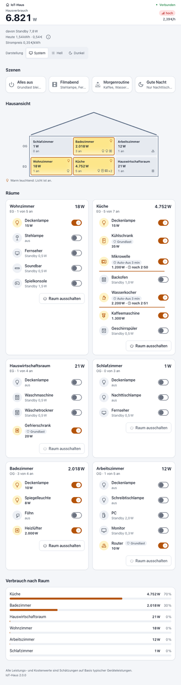
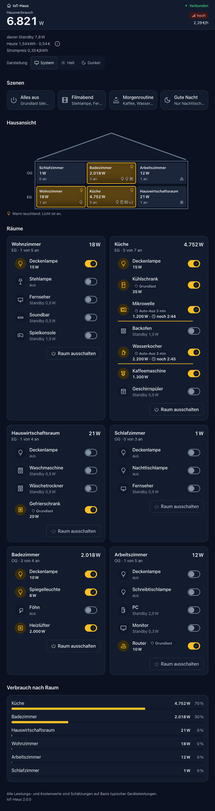
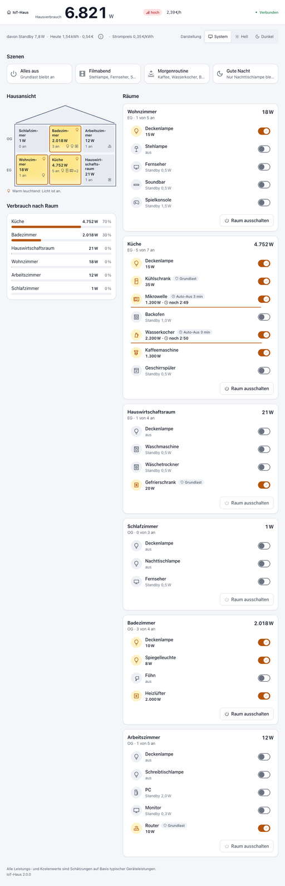
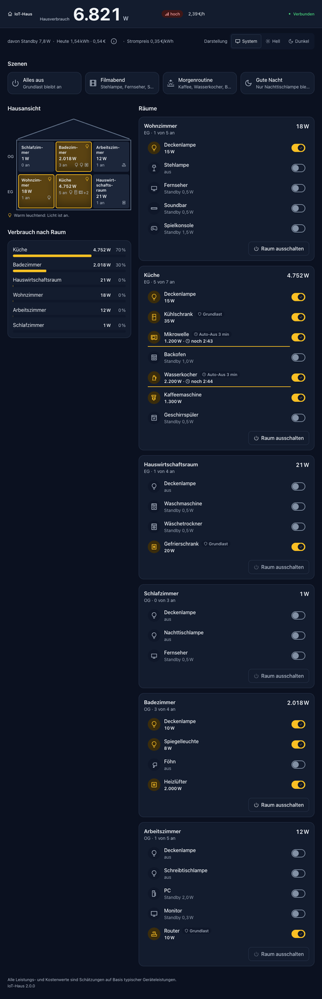
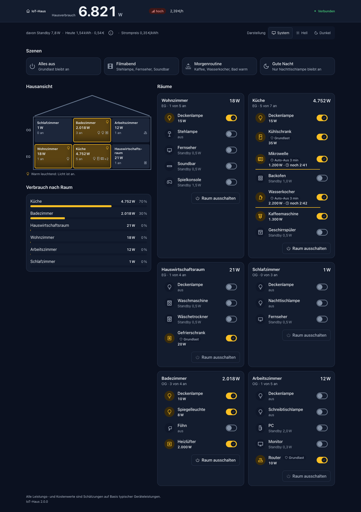
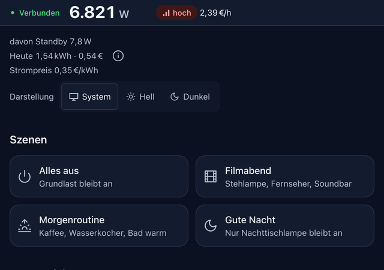

# Abnahme-Checkliste IoT-Haus 2.0 (NFR-10)

**Version:** 2.0.0 · **Stand:** 2026-09-26
**Umgebung der automatisierten Prüfung:** Produktions-Build lokal, headless Chrome, Vitest-Suite, lokaler Docker-Build (arm64)

Die Checkliste hat zwei Teile:

- **A – automatisiert bzw. headless geprüft:** vor dem Release erledigt, mit Nachweis.
- **B – manuell auf echtem Gerät nach Deploy:** braucht echte Hardware oder einen echten Screenreader. Diese Punkte sind
  **noch offen**. Sie werden nicht als erledigt ausgegeben, solange niemand sie tatsächlich geprüft hat.

---

## A – Automatisiert / headless geprüft

### Darstellung (NFR-3)

- [x] 360 px, hell und dunkel: kein horizontales Scrollen, Inhalte vollständig
- [x] 768 px, hell und dunkel: kein horizontales Scrollen
- [x] 1024 px, hell und dunkel: kein horizontales Scrollen, zweispaltiges Layout
- [x] 1440 px, hell und dunkel: kein horizontales Scrollen, zweispaltiges Layout
- [x] Zoom 200 %: bedienbar, kein Abschneiden von Inhalten, keine Zoomsperre im Viewport

Nachweis: headless Chrome, Screenshots unten.

| Breite | Hell | Dunkel |
|---|---|---|
| 360 px |  |  |
| 768 px |  |  |
| 1024 px |  |  |
| 1440 px |  |  |

Zoom 200 %:

### Tastatur (UJ-4, NFR-2)

- [x] Erstes fokussierbares Element ist der Sprunglink „Zu den Räumen springen“
- [x] Enter auf dem Sprunglink setzt den Fokus auf den Bereich „Räume“
- [x] Tab führt von dort zum ersten Geräteschalter
- [x] Leertaste schaltet das Gerät um
- [x] Grundlast-Dialog: Beim Ausschalten eines Grundlastgeräts liegt der Fokus auf „Abbrechen“
- [x] Grundlast-Dialog: Escape schließt ihn, der Fokus kehrt zum auslösenden Schalter zurück

Nachweis: headless Chrome (Tastaturereignisse) und Komponententest `src/components/App.test.tsx`.

### Screenreader-Ansagen (FR-11)

- [x] Die Live-Region (`aria-live="polite"`) enthält nach dem Schalten den Text „Deckenlampe an. Hausverbrauch 6.821 Watt.“

Nachweis: headless Chrome, Inhalt der Live-Region ausgelesen. **Nicht** geprüft ist, ob und wie VoiceOver den Text tatsächlich spricht
(siehe Teil B).

### Synchronisation und Serverautorität (SM-2, FR-14 bis FR-17, FR-5)

- [x] Zwei Clients: Eine Änderung in Client A erscheint in Client B nach **34 ms** (gemessen, beide Clients auf demselben Rechner)
- [x] Ein neu verbundener Client ändert nichts am Zustand
- [x] Auto-Aus läuft nach einem Serverneustart mit der Restzeit weiter und schaltet ab
- [x] Integrationstests: 3 Clients, p95 der Verteilzeit ≤ 250 ms über 100 Befehle; 200 Zufallsbefehle → 100 % konsistent;
  Zustand übersteht Serverneustart; Broker-Ausfall → WebSockets geschlossen, Health 503, danach wieder bereit

### Barrierefreiheit automatisiert (NFR-2)

- [x] axe-core: 0 Verstöße auf der Seite mit Snapshot, in Hell und in Dunkel (automatisierte Tests, jsdom)
- [x] Kontraste aller Farb-Token-Paare nach WCAG-Formel (`tests/architektur/kontrast.test.ts`; in jsdom ist die axe-Regel
  `color-contrast` nicht aussagekräftig und wird dort durch diesen Test ersetzt)
- [x] Schalter haben `role="switch"`, Zustand, Namen und Beschreibung

### Qualität und Budget

- [x] 258 automatisierte Tests grün (`npm test`, Stand nach den Review-Korrekturen)
- [x] `npm run lint`: 0 Befunde
- [x] `npm run typecheck`: 0 Fehler
- [x] JS First Load der Startseite: **118 kB** nach den Review-Korrekturen (Budget 200 kB, `scripts/pruefe-js-budget.mjs`;
  die CI prüft das Budget bei jedem Lauf erneut)
- [x] `actionlint` meldet für `.github/workflows/ci-release.yml` keine Befunde

### Container (lokaler Build, linux/arm64)

- [x] Härtung: kein `curl`, `wget`, `npm` im Image, Prozess läuft als UID 1000
- [x] Image-Healthcheck meldet `healthy` nach **6 s**
- [x] Rauchtest `schalten` (Health 200, Snapshot mit 28 Geräten, Schalten bestätigt) erfolgreich
- [x] Persistenz: nach `docker restart` ist der geschaltete Zustand noch da (Rauchtest `pruefen`)
- [x] Sauberes Herunterfahren bei SIGTERM: Node-Server stoppt vor Mosquitto

Der Multi-Arch-Build (amd64 + arm64) und dieselben Container-Prüfungen auf amd64 laufen im Workflow `ci-release.yml`
(Job `container`); ohne grünen Lauf wird kein Image veröffentlicht.

---

## B – Manuell auf echtem Gerät nach Deploy

Offen. Nach dem ersten Deploy von 2.0.0 prüfen, abhaken und mit Datum und Namen eintragen.

### Screenreader

- [ ] VoiceOver macOS (Safari): Schalter werden als „Schalter, ein/aus“ mit Gerätename und Leistung vorgelesen
- [ ] VoiceOver macOS: Nach dem Schalten wird „‹Gerät› an. Hausverbrauch ‹x› Watt.“ angesagt, schnelle Folgen werden zusammengefasst
- [ ] VoiceOver macOS: Grundlast-Dialog wird als Dialog angesagt, Fokus auf „Abbrechen“
- [ ] VoiceOver iOS (Safari, echtes iPhone): Wischgesten erreichen alle Schalter, Doppeltippen schaltet, Ansage wie oben
- [ ] Verbindungsabbruch und Wiederherstellung werden angesagt („Verbindung wiederhergestellt.“)

### Zwei echte Geräte im Heimnetz (SM-2)

- [ ] Handy und Laptop im selben WLAN gegen den Produktionscontainer: Schalten auf dem Handy erscheint ohne spürbare Verzögerung auf dem Laptop und umgekehrt
- [ ] Szene auf einem Gerät → beide zeigen denselben Hausverbrauch
- [ ] Handy sperren und entsperren → verbindet sich neu und zeigt den aktuellen Stand

### Mobil

- [ ] Echtes Handy, Hochformat: alle Schalter gut treffbar, Kopfbereich bleibt beim Scrollen sichtbar
- [ ] Echtes Handy, Querformat: kein horizontales Scrollen, Kopfbereich verdeckt nicht zu viel
- [ ] Browser-Zoom bzw. Textvergrößerung des Systems auf 200 % auf dem Handy

### Bewegung

- [ ] Mit „Bewegung reduzieren“ (macOS/iOS) zählt der Hausverbrauch ohne Animation direkt auf den neuen Wert, keine Impuls-Animationen
  (im Code über `prefers-reduced-motion` umgesetzt, bisher nicht im Browser geprüft)

### Betrieb

- [ ] Produktionshost: alter `healthcheck`-Block mit `curl` aus der Compose-Datei entfernt, Container nach `pull` + `up -d` `healthy`
- [ ] Zustand übersteht `docker compose restart` auf dem Produktionshost

| Prüfung B durchgeführt am | von | Ergebnis / Abweichungen |
|---|---|---|
| | | |
