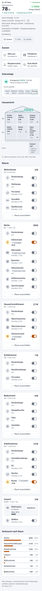
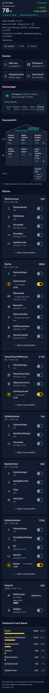
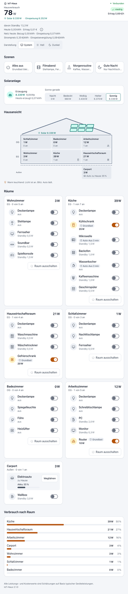
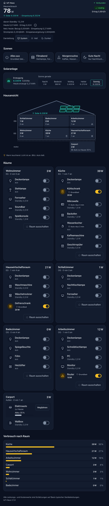
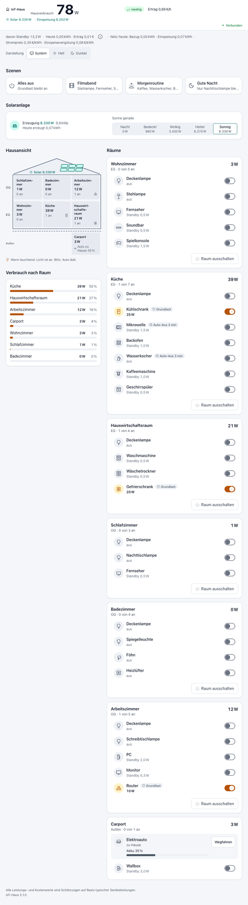
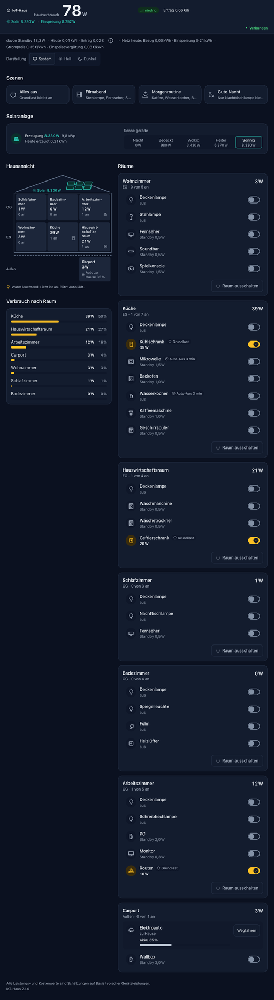
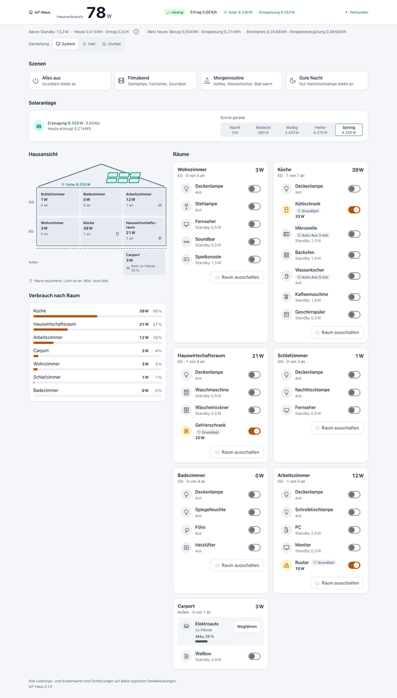
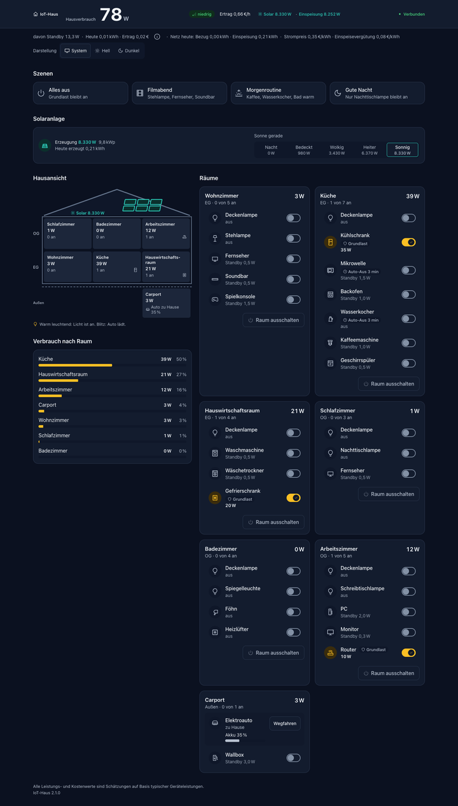

# Abnahme-Checkliste IoT-Haus 2.1 – Elektroauto & Solaranlage (NFR-10)

**Version:** 2.1.0 · **Stand:** 2026-09-27
**Umgebung der automatisierten Prüfung:** Produktions-Build lokal, headless Chrome (zwei Browser-Clients gegen denselben Server),
Vitest-Suite
**Grundlage:** [Sprint Change Proposal 2026-09-27](../_bmad-output/planning-artifacts/sprint-change-proposal-2026-09-27.md),
Akzeptanzkriterien AC-01 bis AC-25

Die Checkliste hat zwei Teile:

- **A – automatisiert bzw. headless geprüft:** vor dem Release erledigt, mit Nachweis.
- **B – manuell auf echtem Gerät nach Deploy:** braucht echte Hardware oder einen echten Screenreader. Diese Punkte sind
  **noch offen**. Sie werden nicht als erledigt ausgegeben, solange niemand sie tatsächlich geprüft hat.

Die Prüfpunkte aus [Abnahme 2.0](./abnahme-2.0.md) gelten weiter; Teil B von 2.0 ist ebenfalls noch offen.

---

## A – Automatisiert / headless geprüft

### Qualität und Budget

- [x] **342** automatisierte Tests grün (`npm test`), Zeilenabdeckung **99 %** (Schwelle 90 % für `src/domain/**` inkl.
  `elektroauto.ts` und `solar.ts` sowie `server/zustandsdienst.ts`)
- [x] `npm run lint`: 0 Befunde
- [x] `npm run typecheck`: 0 Fehler
- [x] `npm run build` erfolgreich; JS First Load der Startseite: **123 kB** (Erwartung ≤ 126 kB, Budget 200 kB,
  `scripts/pruefe-js-budget.mjs`; 2.0: 118 kB)

### Solaranlage und Netzbilanz – zwei Browser (AC-12, AC-13)

Ablauf im headless Chrome mit zwei Clients; jede Aktion in Client A, geprüft in **beiden** Clients.

- [x] Ausgangszustand, Sonne „Sonnig“ gewählt → Kopf „Solar 8.330 W · Einspeisung 8.252 W“ und „Ertrag 0,66 €/h“ in beiden Clients
- [x] Wallbox an (Auto zu Hause, 50 %) → Hausverbrauch **11.075 W**, „Netzbezug 2.745 W“, **0,96 €/h**, am Auto „voll in 2 h 44 min“,
  Meldung „+10.997 W · Wallbox (Carport)“

### Elektroauto – zwei Browser (AC-06, AC-05, AC-07)

- [x] Wegfahren während des Ladens → Meldung „−10.997 W · Elektroauto weggefahren, Laden beendet“; die Wallbox-Zeile ist gesperrt mit
  „Auto unterwegs“
- [x] Zurückkommen → „Akku 35 %“ (Stand bei Abfahrt 50 % minus 15 % Fahrt)

### Fachlogik, Server und Persistenz (automatisierte Tests)

Abgedeckt durch die Suite oben; Nachweis je Punkt in der genannten Datei.

- [x] Laden schreibt den Akku fort, bei 100 % schaltet der Server die Wallbox ab, Ursache `akkuVoll` (AC-04, `server/zustandsdienst.test.ts`)
- [x] Wegfahren beendet das Laden in **einer** Änderung, Zurückkommen zieht 15 % ab (AC-06, AC-07, `server/zustandsdienst.test.ts`)
- [x] Laden unterwegs oder mit vollem Akku und Wegfahren unter 15 % → `NICHT_MOEGLICH`, Zustand unverändert (AC-05, AC-08,
  `src/domain/solar-auto.test.ts`, `tests/integration/protokoll.test.ts`)
- [x] Neustart: Ausfallzeit lädt nicht, inkonsistente Wallbox (Auto unterwegs) wird ausgeschaltet (AC-10, AC-11)
- [x] Sonne ändert Erzeugung und Tagesbilanz und wird gespeichert; 2.000 W bei „Wolkig“ 30 min → Bezug 0, Einspeisung 715 Wh (AC-12, AC-17)
- [x] Energie-Topic `v: 1` aus 2.0 wird als Netzbezug gelesen (AC-18, `server/mqtt-speicher.test.ts`, `tests/integration/persistenz.test.ts`)
- [x] `EINSPEISEVERGUETUNG_EUR_PRO_KWH`: leer, `0`, gültig, ungültig, negativ (AC-19, `server/konfig.test.ts`)
- [x] Sonne wird an alle Clients verteilt; Snapshot enthält Auto, Sonne und Einspeisevergütung (`tests/integration/protokoll.test.ts`)
- [x] Sonnenwahl optimistisch mit Rücksprung bei Fehler (AC-16, `src/client/hausReducer.test.ts`)
- [x] 2.0-Tab gegen 2.1-Server: Versionskonflikt ohne Ausnahme (AC-23, `src/client/hausReducer.test.ts`)

### Darstellung (AC-20)

- [x] Kein horizontales Scrollen bei **360, 390, 768, 1024 und 1440 px**
- [x] Kopfbereich mobil (360 px) **126 px** hoch (Vorgabe ≤ 136 px, 20 % von 640 px, Grenze 30 %)

Nachweis: headless Chrome, Screenshots unten (Hell und Dunkel).

| Breite | Hell | Dunkel |
|---|---|---|
| 360 px |  |  |
| 768 px |  |  |
| 1024 px |  |  |
| 1440 px |  |  |

### Barrierefreiheit automatisiert (AC-22)

- [x] axe-core: **0 Verstöße** in Hell und Dunkel mit der Fixture „Auto lädt, Heiter“ (`src/components/App.test.tsx`, `snapshotLaedt`)
- [x] Kontraste aller Farb-Token-Paare inkl. `solar` und `solar-soft` nach WCAG-Formel (`tests/architektur/kontrast.test.ts`)
- [x] Wallbox gesperrt mit Grund, „Wegfahren“ unter 15 % gesperrt mit sichtbarem Grund (AC-05, AC-08, `src/components/App.test.tsx`)

### Browser-Konsole

- [x] Keine Fehler in der Browser-Konsole während des gesamten Ablaufs (beide Clients)

---

## B – Manuell auf echtem Gerät nach Deploy

Offen. Nach dem ersten Deploy von 2.1.0 prüfen, abhaken und mit Datum und Namen eintragen.

### Tastatur (AC-21)

Headless Chrome, 1280 px, 2026-09-27 (Entwickler):

- [x] Nach den Szenen erreicht ein Tab die Sonnenwahl (eine Tab-Station, 8. Tab-Station der Seite), Pfeiltasten wechseln die Stufe; der Kopf zeigt sofort „Solar 980 W · Einspeisung 902 W“
- [x] In der Hausansicht ist die Carport-Fläche erreichbar; Enter springt zur Carport-Karte (Fokus auf h3 „Carport“)
- [x] In der Carport-Karte folgen „Wegfahren“ bzw. „Zurückkommen“ und danach die Wallbox

### Screenreader (AC-25)

- [ ] VoiceOver macOS (Safari): Wallbox an → Ansage „Wallbox an. Hausverbrauch 11.075 Watt.“
- [ ] VoiceOver macOS: „Sonnig“ wählen → „Sonne: Sonnig. Solar 8.330 Watt. Einspeisung 8.252 Watt.“
- [ ] VoiceOver: Radio wird als „Sonnig, 8.330 Watt, Optionsfeld, 5 von 5, Sonne gerade“ vorgelesen
- [ ] VoiceOver: gesperrte Wallbox als „Wallbox, … nicht verfügbar: Elektroauto ist unterwegs“; Knopf als „Elektroauto wegfahren lassen, Taste“
- [ ] VoiceOver iOS (Safari, echtes iPhone): Sonnenwahl, Wegfahren/Zurückkommen und Wallbox per Wischgesten bedienbar

### Zwei echte Geräte im Heimnetz

- [ ] Handy und Laptop im selben WLAN gegen den Produktionscontainer: Sonnenwahl auf dem Handy erscheint ohne spürbare Verzögerung auf
  dem Laptop und umgekehrt
- [ ] Wallbox an / Wegfahren / Zurückkommen auf einem Gerät → beide zeigen denselben Akkustand und dieselbe Netzbilanz
- [ ] Nach einigen Minuten Laden zeigen beide Geräte denselben Akku-Prozentwert (± 1 Punkt nur an der Umschaltgrenze, AC-03)

### Mobil

- [ ] Echtes Handy, Hochformat: Netz-Zeile im Kopf ohne Umbruch, Sonnenwahl und Carport-Knöpfe gut treffbar
- [ ] Echtes Handy, Querformat (Höhe ≤ 500 px): Kopf einzeilig mit Netzwert, kein horizontales Scrollen
- [ ] Zoom bzw. Textvergrößerung 200 % auf dem Handy: Sonnenwahl bricht sauber um

### Betrieb und Release (AC-15, AC-24)

- [ ] Stakeholder-Zustimmung vor dem Merge auf `main` eingeholt
- [ ] Nach dem Merge: Tag `v2.1.0`, Image `:2.1.0`/`:latest` und GitHub Release mit `.github/release-hinweise/v2.1.0.md` vorhanden
- [ ] Produktionshost: `pull` + `up -d` ohne weiteren Schritt, Container `healthy`, `/api/health` meldet `"version":"2.1.0"`
- [ ] Tagesverbrauch aus 2.0 nach dem Upgrade übernommen (kein Sprung auf 0)
- [ ] Offener 2.0-Tab zeigt nach dem Upgrade „Neue Version verfügbar“
- [ ] Nach `docker compose restart` sind Sonnenlage, Elektroauto und Tageswerte erhalten

| Prüfung B durchgeführt am | von | Ergebnis / Abweichungen |
|---|---|---|
| | | |
